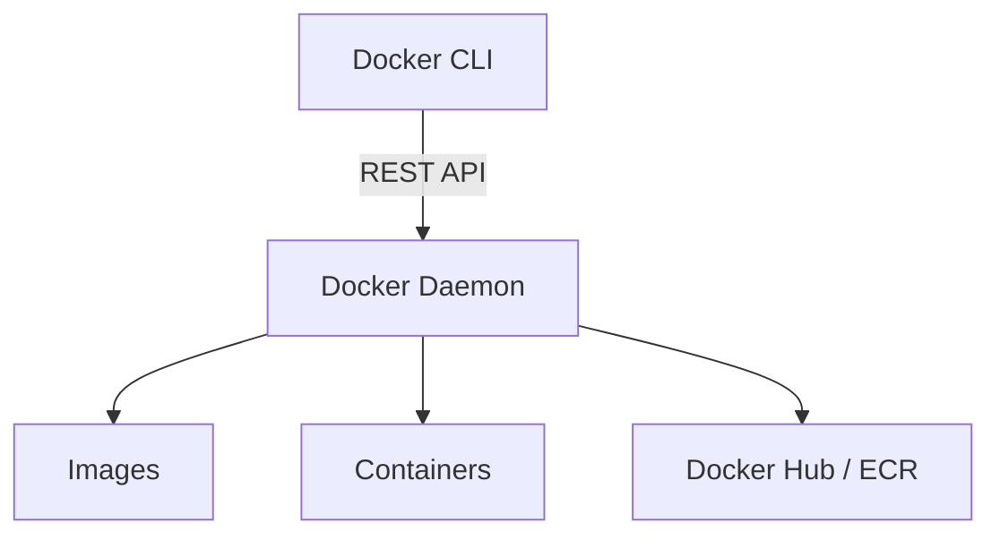

# Docker & Docker Swarm: System Design & Interview Guide

## 1. What is Docker?
Docker is a platform designed to help developers build, share, and run modern applications. It packages software into standardized units called **containers** that hold everything the software needs to run, including libraries, system tools, code, and runtime.

**Why Containers over VMs?**
- **VMs (Virtual Machines)** include a full Guest OS on top of a hypervisor, which makes them heavy, slow to boot, and resource-intensive.
- **Containers** share the Host OS kernel directly. This makes them extremely lightweight, fast to start (often in milliseconds), and highly portable.

## 2. Architecture & Core Concepts

- **Docker Daemon (`dockerd`)**: The brain of Docker. It listens for Docker API requests and manages Docker objects like images, containers, networks, and volumes.
- **Docker Images**: Read-only templates with instructions to create a container. Built using a `Dockerfile`.
- **Docker Containers**: Runnable instances of an image. They encapsulate your application.
- **Docker Registry**: Centralized storage and distribution systems for images (e.g., Docker Hub, AWS ECR).

## 3. What is Docker Swarm?
Docker Swarm is Docker's native clustering and orchestration tool. It allows you to group multiple Docker hosts into a single, virtual Docker host (a cluster), enabling you to deploy and manage containers at scale.

### How does Docker Swarm extend to Kubernetes? (Why not Docker Swarm?)
Initially, Swarm was highly popular because it was extremely easy to set up—it is built directly into the Docker engine (`docker swarm init`).

However, the industry largely shifted from Docker Swarm to **Kubernetes (K8s)** for large-scale and enterprise system designs because:
1. **Extensibility & Flexibility**: Kubernetes is highly modular and customizable (custom resources, operators). Swarm is relatively rigid and limited to its built-in features.
2. **Auto-scaling Capabilities**: K8s has robust autoscaling (HPA, VPA, Cluster Autoscaler). Swarm largely requires manual scaling or third-party workarounds.
3. **Advanced Networking & Storage**: K8s integrates with advanced cloud-native storage interfaces (CSI) and networking interfaces (CNI) like Calico or Cilium. Swarm's networking is simpler but less capable of handling complex enterprise topologies.
4. **Community and Ecosystem**: K8s is backed by the CNCF and every major cloud provider offers managed K8s (EKS, GKE, AKS), making it the undisputed industry standard.

**Conclusion**: Use Docker Swarm for very small, simple deployments where K8s is overkill. Use Kubernetes for everything else, especially enterprise-grade, scalable, and resilient system designs.

## 4. Key Interview Questions

**1. How is a container fundamentally different from a VM at the OS level?**
*Answer*: A VM abstracts the hardware and runs a full, independent Guest OS. A container abstracts the application layer and shares the Host OS Kernel through Linux namespaces (for isolation) and cgroups (for resource limiting). 

**2. What happens to the data when a Docker container stops or is deleted?**
*Answer*: All data stored within the container's writable layer is lost. To persist data beyond the lifecycle of a container, you must use **Docker Volumes** or **Bind Mounts**.

**3. Explain Docker caching and how to optimize a Dockerfile.**
*Answer*: Every instruction in a `Dockerfile` (e.g., `RUN`, `COPY`) creates a layer. If the instruction and corresponding files haven't changed, Docker reuses the cached layer to speed up builds. To optimize: 
- Group commands together (e.g., `RUN apt-get update && apt-get install...`).
- Copy `package.json` and run `npm install` *before* copying the rest of your source code. This ensures the heavy dependency installation step is cached even if your application code changes.
