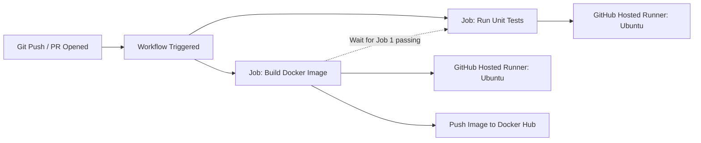

# GitHub Actions: System Design & Interview Guide

## 1. What is GitHub Actions?
GitHub Actions is a CI/CD (Continuous Integration/Continuous Deployment) and automation platform fully integrated into GitHub. It allows you to automate software development workflows—like building, testing, and deploying—directly from your code repository without needing external tools like Jenkins.

## 2. Core Concepts
- **Workflow**: A configurable automated process defined by a YAML file residing in `.github/workflows/`.
- **Event**: A specific trigger that starts a workflow. Examples include a `push` to the main branch, creating a `pull_request`, opening an an `issue`, or firing on a `cron` schedule.
- **Jobs**: A workflow comprises one or more jobs. By default, multiple jobs run **in parallel** unless you define a dependency (e.g., Job B `needs` Job A to finish first).
- **Steps**: Each job contains a sequence of steps. A step is an individual task that can either run a raw shell script (e.g., `npm run test`) or use a pre-packaged Action.
- **Actions**: Reusable, pre-packaged blocks of code written by the community or GitHub. For example:
  - `actions/checkout@v3` (pulls your repository code into the runner)
  - `docker/build-push-action@v2` (automates Docker image building)
- **Runners**: The actual virtual servers that run your workflows.

## 3. Architecture Overview

## 4. System Design & Interview Context

**1. Interview Question: When would you prioritize using a Self-hosted Runner instead of a standard GitHub-hosted Runner?**
*Answer*: GitHub provides managed runners with baseline hardware for free on public repos (and paid minutes for private repos). However, you must design a system with **Self-hosted Runners** in three main scenarios:
1. **Network Security & Isolation**: If your build process needs to communicate with an internal, on-premise private database or legacy system that resides behind an enterprise firewall. GitHub-hosted runners exist in GitHub's cloud and cannot securely tunnel into your private corporate network without massive risk.
2. **Specialized Hardware**: When your CI pipeline requires specific hardware that GitHub's standard runners don't provide (e.g., high-end GPUs for AI/ML model training, or specific ARM architecture processors).
3. **Execution Time / Cost Efficiency**: If you have existing deep server infrastructure, and your enterprise runs tens of thousands of heavy builds per day, it is economically unviable to pay GitHub for massive compute minutes. Instead, routing builds to idle internal hardware maximizes existing capital expenditure.

**2. Security Best Practices**
When designing a CI/CD pipeline, never hardcode passwords, API keys, or Docker Hub credentials in your YAML files. An interviewer will expect you to state that all sensitive data must be securely stored in **GitHub Secrets**. These are encrypted end-to-end and injected securely into the runner environment at runtime (e.g., access via `${{ secrets.DOCKER_PASSWORD }}`).

**3. CI Optimization technique: Dependency Caching**
To drastically reduce CI runtime, you must cache static dependencies. For instance, in a large Node.js application, downloading `node_modules` can take minutes. GitHub Actions provides the `actions/cache` action to save the downloaded dependencies between workflow runs. If the `package-lock.json` hash hasn't changed on a new branch, the runner restores the `node_modules` cache instantaneously rather than downloading from NPM.
