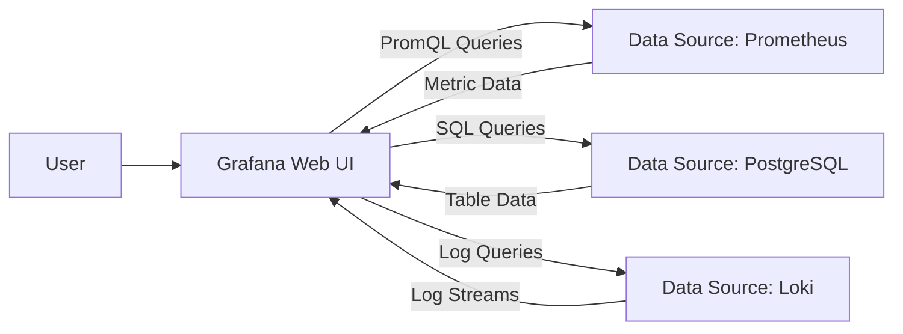

# Grafana: System Design & Interview Guide

## 1. What is Grafana?
Grafana is an open-source analytics and interactive visualization web application. It allows you to query, visualize, set threshold alerts on, and understand your metrics no matter where they are stored. 

## 2. How it works with Prometheus and other sources
Grafana is often mentioned in the same breath as Prometheus (the "Prometheus/Grafana Stack"), but Grafana itself does not store any data. 
- **Prometheus** acts as the database (storage and querying engine). 
- **Grafana** acts as the presentation layer (UI).

Furthermore, Grafana is agnostic. It acts as a single pane of glass, allowing you to combine data from dozens of different databases into a single dashboard.

## 3. Core Concepts
- **Data Source**: The backend that provides the data. This can be Prometheus, Elasticsearch, InfluxDB, AWS CloudWatch, Datadog, MySQL, etc.
- **Dashboard**: A collection of visualizations organized into rows. This represents a cohesive view of a system (e.g., "Kubernetes Cluster Health" or "Node.js Backend Metrics").
- **Panel**: The basic building block of a dashboard. A panel can be a time-series line graph, a bar chart, a single-stat gauge, a heavily formatted table, or a heatmap. Each panel corresponds to a specific query to a Data Source.
- **Variables / Templating**: Allows for interactive dashboards. Instead of hardcoding a server name into a query, you use a variable (e.g., `$namespace`). The user selects "production" from a dropdown, and every panel instantly updates to show only production metrics.

## 4. System Design & Interview Context

**1. Interview Scenario: "Our application is suddenly slow for users. Walk me through how you'd debug it using your monitoring stack."**
*Answer Structure*:
1. **High-Level Dashboard**: I would open the Grafana overview dashboard and immediately check the **RED metrics** (Rate of requests, Error rates, and Duration/Latency).
2. **Identify the Anomaly**: I'd look for a spike in latency (Duration) or a drop in success rates. Let's say latency has spiked on the `User-Service`.
3. **Drill Down via Variables**: I would use Grafana dropdown variables to filter the dashboard exclusively to the `User-Service` pods. 
4. **Correlate with Infrastructure**: I would look at the corresponding infrastructure panels for those pods. Is CPU hitting 100%? Is memory maxed out (OOMKilled)? Are database connection pools exhausted?
5. **Cross-Reference Tooling**: If metrics alone don't reveal the exact cause, I would use Grafana's capability to pivot to logs (e.g., Grafana Loki) or distributed traces (e.g., Grafana Tempo/Jaeger) corresponding to the exact timestamp of the latency spike.

**2. Key Monitoring Philosophies in System Design**
- **The Four Golden Signals** (Google SRE Book):
  1. *Latency*: Time taken to service a request.
  2. *Traffic*: Total demand (requests per second).
  3. *Errors*: Rate of failed requests (500s).
  4. *Saturation*: How "full" your service/resources are (CPU%, Queue length).
  You design Grafana dashboards to prominently display these four signals for every service.

**3. Why use Grafana Alerting if Prometheus has Alertmanager?**
While Prometheus evaluates metrics to fire alerts, Grafana can do the same. Many teams use Grafana alerting because it allows you to create alerts visually (from the UI graphs directly) and you can set alerts that combine rules across *different* data sources (e.g., trigger an alert if Prometheus CPU > 90% AND Elasticsearch Log Errors > 100).
