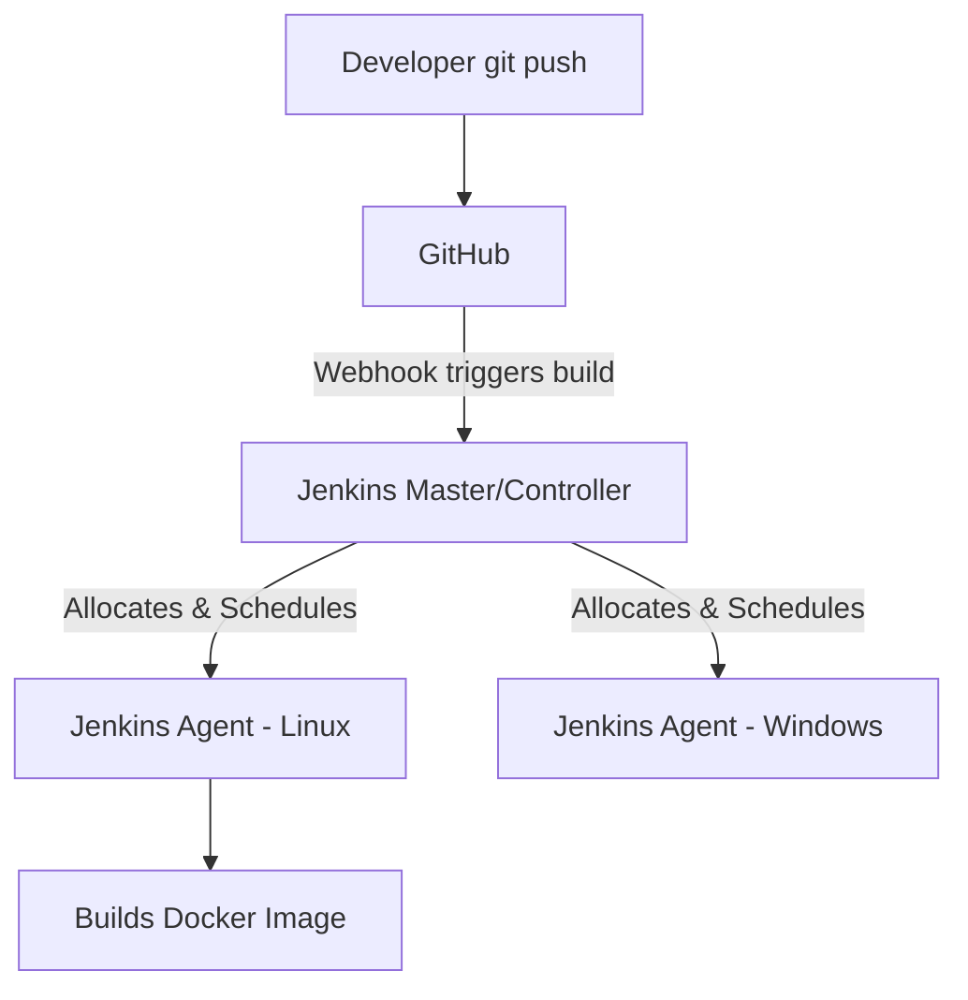

# Jenkins: System Design & Interview Guide

## 1. What is Jenkins?
Jenkins is an open-source automation server. Specifically, it is the most widely adopted tool for implementing Continuous Integration (CI) and Continuous Delivery/Deployment (CD) pipelines. It automates the building, testing, and deployment of modern software.

## 2. CI/CD Core Concepts
- **Continuous Integration (CI)**: The practice where developers frequently merge code to a central repository (e.g., `main` branch). A CI system like Jenkins automatically kicks off a build process and runs unit/integration tests to ensure the new code hasn't broken the application.
- **Continuous Delivery (CD)**: Automatically packaging and delivering the built code to environments (Staging/Production). Delivery implies it is ready to be deployed, but requires manual approval. Continuous *Deployment* removes the manual approval step entirely.
- **Jenkinsfile**: A text file (usually written in Groovy syntax) that defines the entire pipeline process (Pipeline-as-Code). It contains the steps to checkout code, build it, run tests, and deploy.

## 3. Master-Agent (Controller-Agent) Architecture
Jenkins is fundamentally designed to be a distributed system.

- **Master (Controller)**: The central brain of the operation. It serves the web UI, manages system configurations, authenticates users, and crucially, *schedules* the jobs. It strongly advised **not** to run actual build tasks on the Master because a heavy build could consume all CPU/Memory and crash the entire Jenkins system.
- **Agents (Slaves/Executors)**: Machines connected to the master. They passively wait for the master to assign them build jobs. They execute the jobs and report the results back. You can configure specialized agents (e.g., an agent with specifically Docker installed, a Windows agent for .NET apps, a macOS agent to build iOS apps).

## 4. System Design & Interview Context

**1. Interview Question: Jenkins vs. GitHub Actions/GitLab CI?**
*Comparison*:
- **Jenkins**: Highly customizable, possesses a massive plugin ecosystem (over 1800 plugins), and is excellent for complex enterprise on-premise setups adhering to strict internal security compliance. However, it requires significant maintenance overhead (managing infrastructure, updating JVMs, patching plugins, fixing the Master if it goes down).
- **GitHub Actions / GitLab CI**: Fully managed, lives right within your code repository, uses simple YAML instead of Groovy, and is significantly easier to set up for standard cloud-native projects.

**2. Scaling Jenkins in an Enterprise Architecture**
*Scenario*: As your team grows, you are running thousands of builds a day. How do you scale Jenkins?
1. **Dynamic Ephemeral Agents**: Do not use static VMs that sit idle when there are no builds. Integrate Jenkins with Kubernetes or AWS Auto Scaling. When a build is triggered, Jenkins requests a Kubernetes Pod, runs the build inside it, and immediately destroys the pod when finished to save compute costs.
2. **High Availability (HA)**: The Master is a single point of failure. Store Jenkins configurations and job histories on an external shared file system (like NFS or AWS EFS) and regularly back it up. Set up an Active/Passive standby Master.
3. **Pipeline Optimization**: Run parallel stages where possible (e.g., running unit tests and linting concurrently) and heavily utilize caching (e.g., caching `node_modules` or `.m2` folders) to drastically lower build times.
