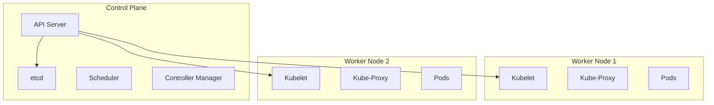

# Kubernetes (K8s): System Design & Interview Guide

## 1. What is Kubernetes?
Kubernetes (K8s) is an open-source container orchestration platform that automates the deployment, scaling, management, and networking of containerized applications. Originally developed by Google, it is now the industry standard for cloud-native infrastructure.

## 2. Architecture Overview

A K8s cluster primarily consists of a **Control Plane** (the master/brain) and **Worker Nodes** (the muscle).

### Control Plane Components:
- **API Server (`kube-apiserver`)**: The frontend of the control plane. All components and external users communicate with the cluster through this API.
- **etcd**: A highly-available, consistent key-value store. This is the **cluster's database/memory**—it stores all cluster data and state. If `etcd` dies, the cluster dies.
- **Scheduler (`kube-scheduler`)**: Watches for newly created Pods with no assigned node, and selects a node for them to run on based on resource requirements, constraints, and affinity rules.
- **Controller Manager (`kube-controller-manager`)**: Runs controller processes that regulate the state of the cluster. If a node goes down, the controller notices and takes action to spin up replacement pods elsewhere.

### Worker Node Components:
- **Kubelet**: An agent that runs on each node. It communicates with the API Server and ensures that containers are running and healthy inside Pods.
- **Kube-Proxy**: Maintains network rules on the host, enabling communication to your Pods from network sessions inside or outside of your cluster.
- **Container Runtime**: The underlying software that actually runs the containers (e.g., `containerd`, `CRI-O`).

## 3. Core Concepts

- **Pod**: The smallest, most basic deployable unit in K8s. A pod represents a single instance of a running process in your cluster and can encapsulate one or more containers that share the same network namespace and storage volumes.
- **Deployment**: A higher-level abstraction that manages stateless applications. It dictates how many identical replicas of a Pod should be running and manages rolling updates and rollbacks.
- **Service**: An abstract way to expose an application running on a set of Pods. Since Pods are ephemeral (they die and get new IP addresses), a Service provides a stable IP address and DNS name to access them.
- **Ingress**: Manages external access to the services in a cluster, typically HTTP/HTTPS routing. It acts as an API gateway/reverse proxy.

## 4. System Design & Interview Context

**1. Self-Healing Architecture**
*Scenario*: A worker node crashes.
*Mechanism*: The Controller Manager detects the node is unreachable. The ReplicaSet (managed by the Deployment) realizes the desired number of Pods (e.g., 3) does not match the actual number (now 2). It requests the API server to create a new Pod. The Scheduler assigns this new Pod to a healthy node.

**2. Scaling in Kubernetes**
- **HPA (Horizontal Pod Autoscaler)**: Automatically scales the *number of Pods* up or down based on CPU, memory, or custom metrics (e.g., number of queued requests).
- **VPA (Vertical Pod Autoscaler)**: Adjusts the CPU/memory *requests and limits* for containers inside a Pod.
- **Cluster Autoscaler**: Automatically scales the *number of worker nodes* in your cloud provider based on pending Pods that cannot be scheduled due to resource constraints.

**3. Common System Design Question: How does external user traffic reach your backend API?**
*Flow*: 
1. The user hits a domain name mapped to a Cloud Load Balancer.
2. The Load Balancer forwards traffic to the **Ingress Controller**.
3. The Ingress Controller reads Ingress rules and routes the request to a specific **Service** (e.g., `backend-svc`).
4. The Service uses `kube-proxy` rules to load-balance the request to one of the active **Pods** running your backend application.
