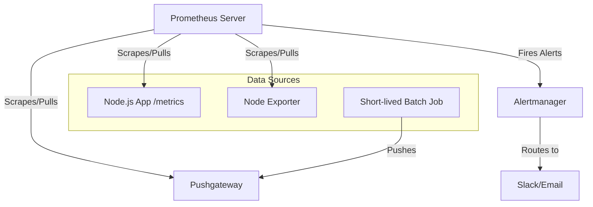

# Prometheus: System Design & Interview Guide

## 1. What is Prometheus?
Prometheus is an open-source, metrics-based monitoring and alerting system originally built at SoundCloud. It is specifically designed for high-reliability, dynamic environments like Kubernetes, where instances are constantly spinning up and down.

## 2. Architecture & The "Pull" Mechanism
The most defining characteristic of Prometheus is that it uses a **Pull-based mechanism**. Instead of your services actively sending (pushing) data to Prometheus, Prometheus reaches out to your services (targets) at specified intervals and scrapes (pulls) the metrics via an HTTP endpoint (usually `/metrics`).

### Key Components:
- **Prometheus Server**: Scrapes targets, stores the data in an embedded Time-Series Database (TSDB), and runs rules/queries over that data.
- **Exporters**: Translates non-Prometheus metrics into a format Prometheus can understand. For example, `Node Exporter` exposes hardware/OS metrics (CPU, memory, disk) of a Linux server.
- **Pushgateway**: Used for short-lived, ephemeral batch jobs that do not live long enough to be scraped. The job pushes its final metrics to the Pushgateway before dying, and Prometheus scrapes the Pushgateway at its leisure.
- **Alertmanager**: Handles alerts sent by the Prometheus server. It deduplicates, groups, and routes them to receivers like Slack, PagerDuty, or Email.

## 3. Data Model & PromQL
Prometheus is fundamentally a **Time-Series Database (TSDB)**. Every metric is stored as a stream of timestamped values.
- **Metrics**: Data is identified by metric name and key/value pairs (labels).
  - Example: `http_requests_total{method="GET", status="200", route="/api/users"}`
- **PromQL (Prometheus Query Language)**: A highly flexible querying language allowing you to slice, dice, and aggregate time-series data in real-time.
  - *Example*: `rate(http_requests_total[5m])` calculates the per-second average rate of HTTP requests over the last 5 minutes.

## 4. System Design & Interview Context

**1. Why use a "Pull" architecture instead of "Push" (like StatsD/DataDog)?**
- **Failure Detection**: If a service goes down, a Push system might not immediately notice—it just stops receiving data (which could also mean zero user traffic). In a Pull system, Prometheus actively tries to scrape the endpoint. If it fails, Prometheus immediately marks the target as `down` natively.
- **Decentralized Configuration**: High-volume applications don't need to be configured with the IP address of the monitoring server or handle connection retries/backoffs. They just expose a `/metrics` text endpoint, entirely oblivious to who is scraping it.
- **Scalability**: Pulling is highly efficient and minimizes network overhead on the application side.

**2. How do you scale Prometheus in a massive system design?**
Prometheus is a single binary and does not natively support horizontal clustering. If one Prometheus server cannot handle the load (e.g., millions of active time series):
- **Functional Sharding**: Run different Prometheus servers for different teams or domains (e.g., one for databases, one for frontend apps).
- **Federation**: Have "child" Prometheus servers scrape detailed metrics locally, and have a "global" Prometheus server scrape aggregated, high-level metrics from the children.
- **Long-Term Storage (LTS)**: Native Prometheus only keeps data for a limited time (e.g., 15 days). To keep metrics for years, integrate with LTS solutions like **Thanos** or **Cortex**.

**3. What are the limitations of Prometheus?**
Prometheus is built for reliability, not 100% accuracy. If a scrape interval is missed during a network blip, or if you need to calculate exact billing data down to the microsecond, Prometheus is the wrong tool. It is designed to give you the operational health and performance trends of your system.
