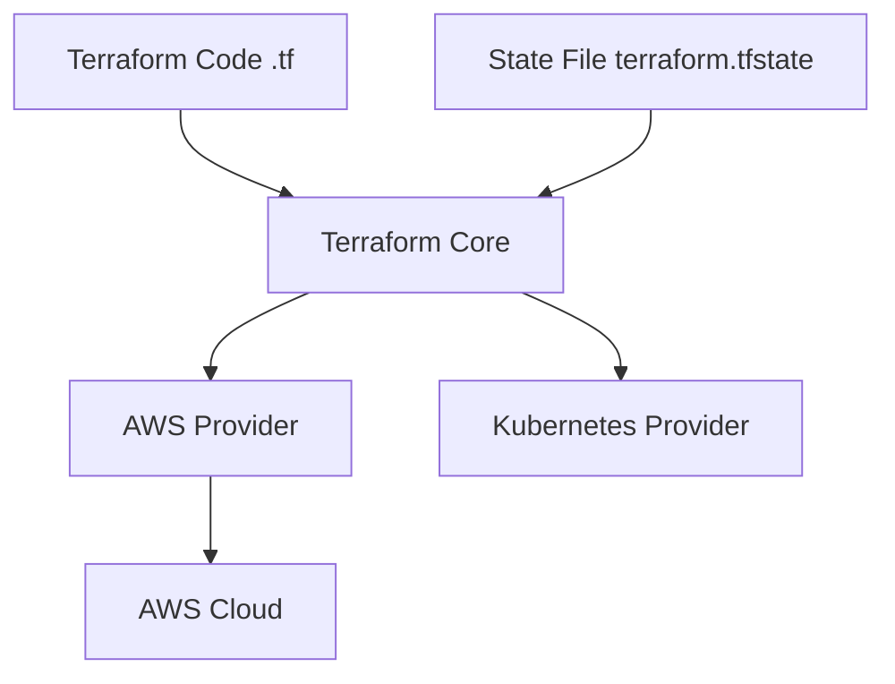

# Terraform: System Design & Interview Guide

## 1. What is Terraform?
Terraform is an Infrastructure as Code (IaC) tool created by HashiCorp. It allows developers and operations teams to safely, predictably, and efficiently create, change, and improve infrastructure using a declarative configuration language (HCL - HashiCorp Configuration Language).

## 2. Declarative vs. Imperative Infrastructure
This is a critical concept in system design and IaC.
- **Imperative (e.g., Bash scripts, Ansible usually)**: You define *how* to get to the end state. (e.g., "Run this command to create a server. Run this to add an IP. Run this to attach a volume.") If you run the script twice, it might fail or create duplicate resources.
- **Declarative (e.g., Terraform)**: You define the *desired end state*. (e.g., "I want exactly one AWS EC2 instance with an Elastic IP attached.") Terraform figures out how to achieve it. If the server already exists, Terraform does nothing. If it lacks an IP, Terraform adds it.

## 3. Architecture & State Management

### The State File (`terraform.tfstate`)
This is the most critical component in Terraform's architecture. It is a JSON file that acts as a blueprint of the real-world infrastructure. 
When you run `terraform apply`, Terraform compares your **Code** with the **State File** to determine what needs to be created, updated, or destroyed to match reality with your desired state.

## 4. Core Workflow
1. `terraform init`: Initializes the working directory, downloads required provider plugins (like AWS, GCP, Azure).
2. `terraform plan`: Shows an execution plan—a "dry run." It tells you exactly what *will* happen without actually making any changes.
3. `terraform apply`: Applies the changes outlined in the plan to reach the desired state.
4. `terraform destroy`: Safely tears down all managed infrastructure.

## 5. System Design & Interview Context

**1. Interview Question: How do you manage Terraform state in a team environment?**
*Answer Structure*:
You should **never** store the state file locally or commit it to a Version Control System like Git because it can contain sensitive secrets (database passwords, API keys) in plaintext. 
Instead, you must use a **Remote Backend** architecture:
- Store the state file centrally in an object store like **AWS S3** or **HashiCorp Terraform Cloud**.
- Implement **State Locking** using a fast, highly-available NoSQL database like **AWS DynamoDB**. This ensures that if Engineer A and Engineer B run `terraform apply` concurrently, Engineer B's run will be blocked until Engineer A finishes, preventing catastrophic state corruption.

**2. Interview Question: What is Infrastructure Drift, and how do you handle it?**
*Answer*: Drift happens when your real-world infrastructure is modified manually via the cloud provider's console (e.g., someone clicked a button to add more RAM to a VM) instead of via Terraform. When this happens, the real-world infrastructure drifts away from the Terraform state and code. 
When you run the next `terraform plan`, Terraform detects this discrepancy. On `terraform apply`, Terraform resolves the drift by reverting the manual, out-of-band changes to match the declarative code.

**3. Tool Comparison: Terraform vs. Ansible/Chef/Puppet**
*Distinction*: Terraform is an **Infrastructure** Provisioning tool (creating the servers, VPCs, subnets). Ansible, Chef, and Puppet are primarily **Configuration Management** tools (installing software, configuring the OS, managing files inside an already existing server). They are often used together: Terraform builds the server, and Ansible installs the application on it.
