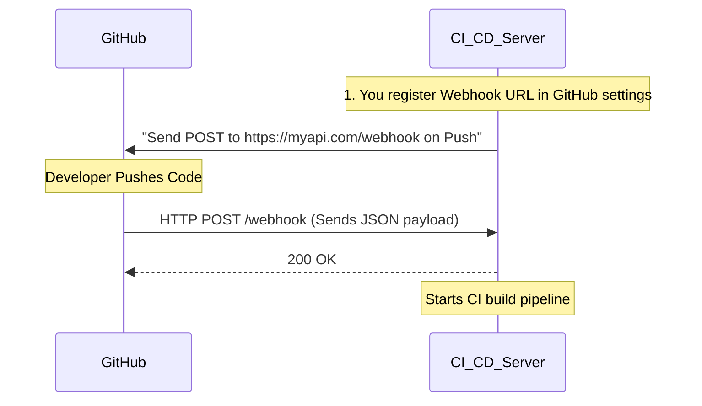

# Webhooks: System Design & Interview Guide

## 1. What is a Webhook?
A webhook (often called a web callback or HTTP push API) is a mechanism that allows applications to communicate with each other in real-time. It provides a way for one system to provide other applications with data instantly as soon as a specific event occurs.

Unlike typical REST APIs where the client must constantly "poll" (ask repeatedly) to check for new data, Webhooks use a **Push** model. The provider pushes data to the consumer's server immediately.

**Analogy**: 
- **API Polling**: A child in the backseat repeatedly asking, "Are we there yet? Are we there yet? Are we there yet?"
- **Webhook**: The driver saying, "I'll let you know when we get there."

## 2. How it Works
1. **Provider**: The source system where the event happens (e.g., GitHub, Stripe, PayPal, Slack).
2. **Consumer (Listener)**: Your application server that registers a public URL to receive the event data via an HTTP POST request.

## 3. System Design Context: Building a Robust Webhook System
This is a very common senior engineering interview question. If you are asked to design a Webhook dispatch system (e.g., "Design a webhook framework for Stripe"), you must architect it to handle failures, latency, and scale gracefully.

### Key Considerations for Consumer Integration:

1. **Strict Asynchronous Processing**: 
   When the provider sends a webhook to your server, your server should **immediately reply `200 OK` or `202 Accepted`** and place the webhook payload into a Message Queue (like RabbitMQ, Kafka, or AWS SQS). 
   *Why?* If your server attempts to do heavy database processing *before* responding to the HTTP request, the provider (like Stripe) might experience a timeout. Stripe will assume your server is dead and aggressively retry the webhook. By pushing the data to an async queue, you decouple the reception from the processing.

2. **Idempotency (Crucial Concept)**: 
   Because of network instability, a webhook might be delivered twice by the provider (At-least-once delivery). The consumer application MUST be designed to be idempotent—meaning receiving the same payload twice does not cause unintended duplicative side effects (e.g., you do not want to charge a customer's credit card twice for the same event).
   *Solution*: Typically achieved by extracting a unique `event_id` from the payload and saving it in a database table or Redis cache. Before processing, always query: "Have I seen this `event_id` before?" If yes, ignore it.

3. **Security, Authentication, and Signatures**:
   How does your backend know the webhook actually came from GitHub and not a malicious hacker running `curl`? 
   You must implement **Signature Verification**. The provider cryptographically signs the payload using a pre-shared secret key, sending an HMAC signature in the HTTP Headers (e.g., `X-Hub-Signature-256`). When your server receives the request, it calculates an HMAC hash of the raw request body using the shared secret and compares it to the header. If they match, the payload is authentic.

### Key Considerations for Designing a Webhook Provider:

1. **Retries with Exponential Backoff**: 
   What if the consumer server is down for maintenance? The provider must feature a retry mechanism. It should retry sending the webhook after 1 minute, then 5 minutes, 30 minutes, 2 hours, etc. After a certain threshold (e.g., 3 days), it should disable the webhook URL entirely to prevent wasting network bandwidth.
2. **Circuit Breakers / Rate Limiting**: If a consumer server is returning consecutive `500 Internal Server Errors`, the provider should temporarily short-circuit the connection to avoid overwhelming the struggling consumer.
